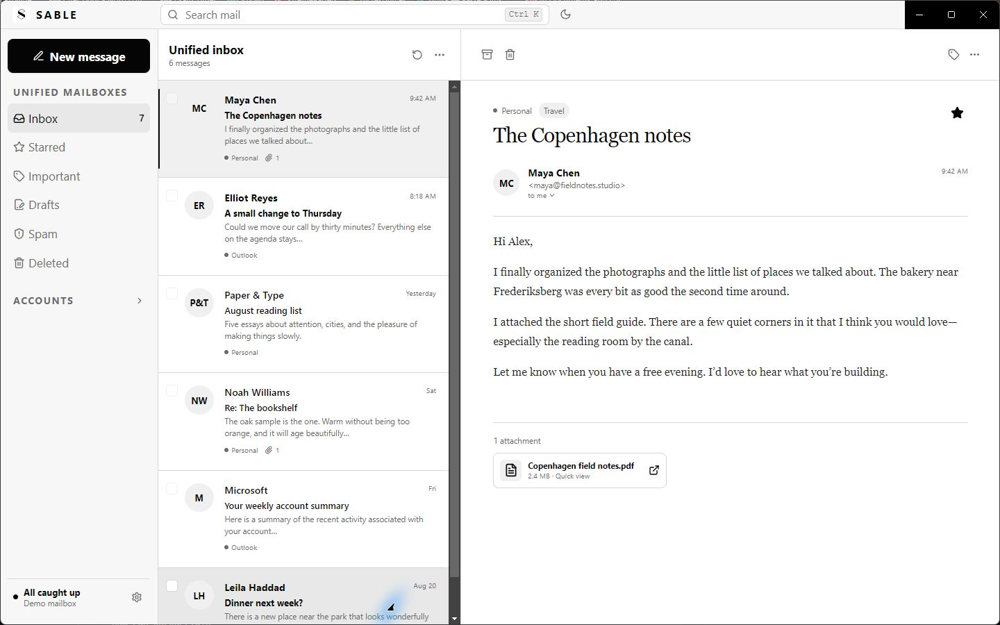
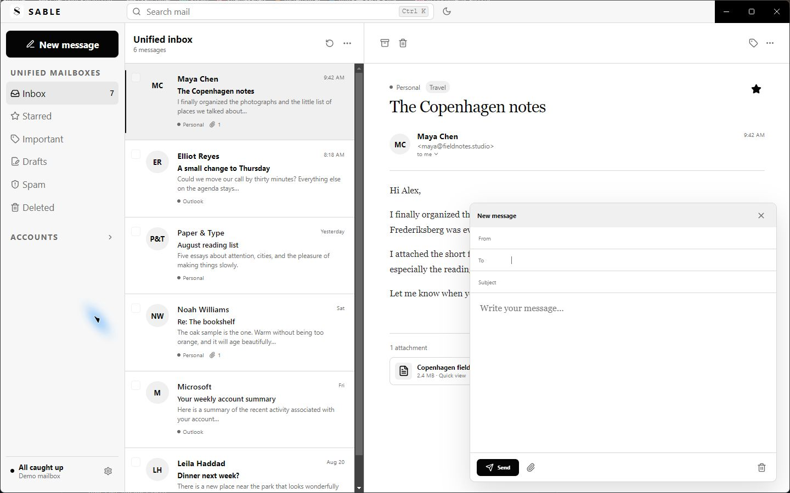
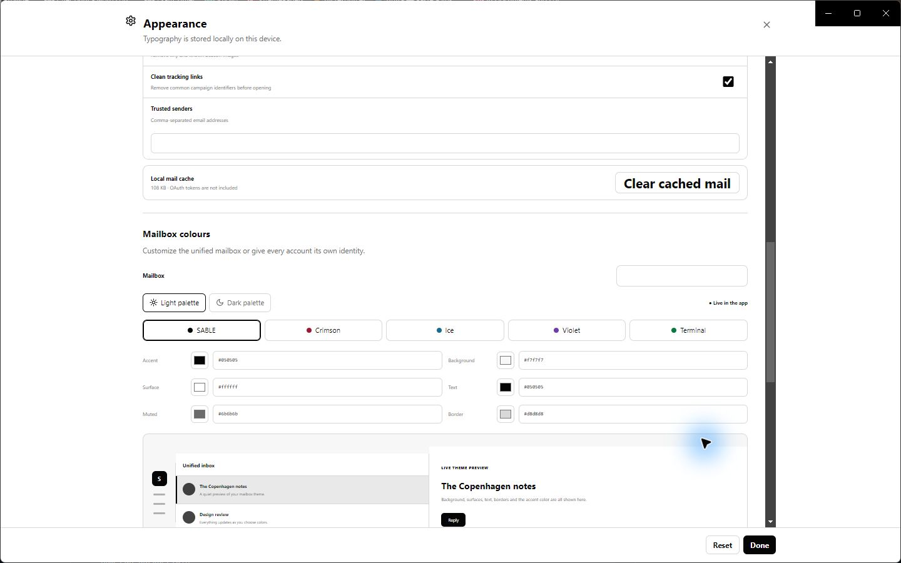
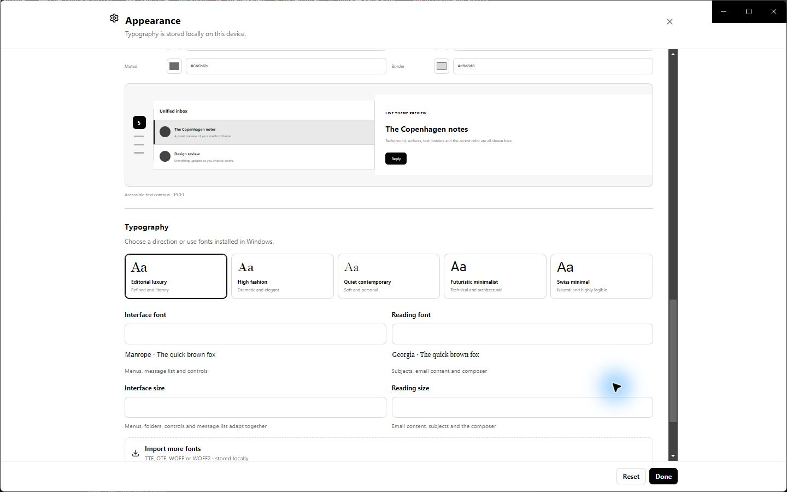
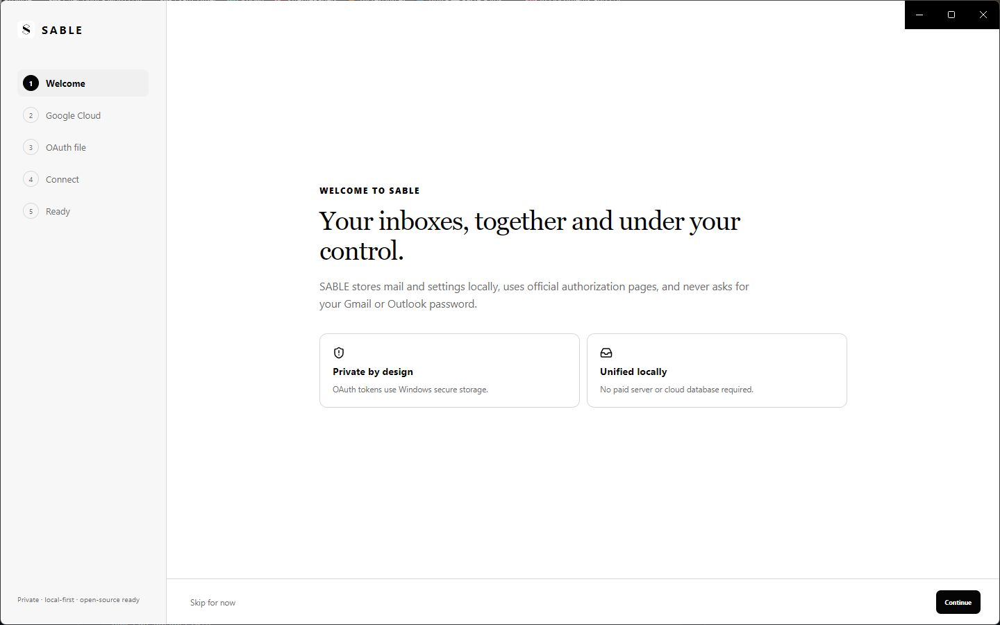
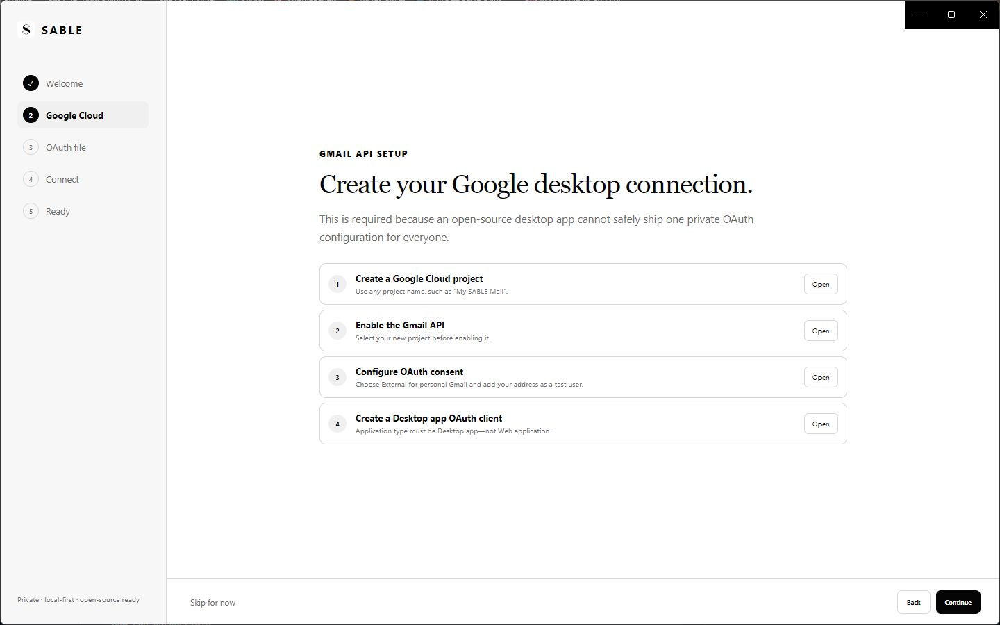
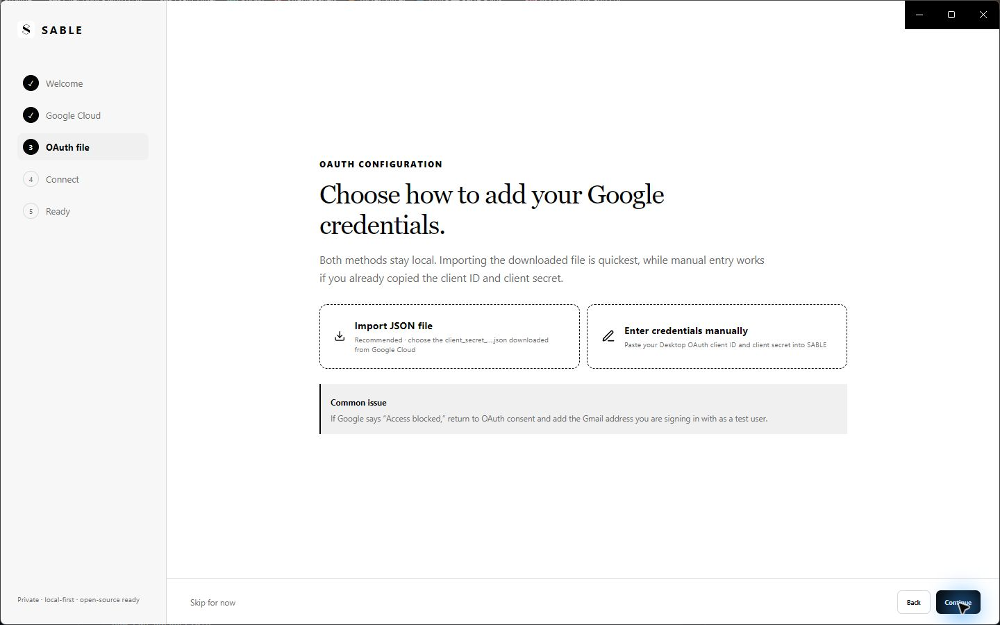
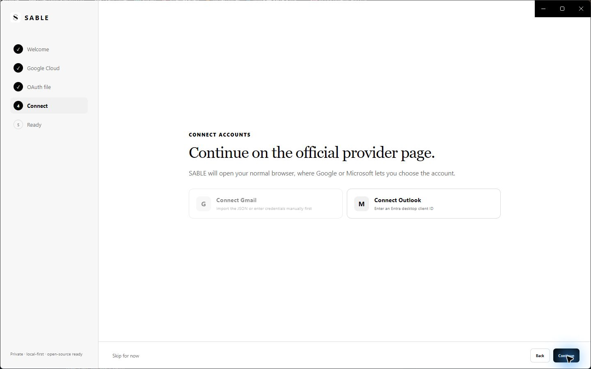

# SABLE

**A minimalist, local-first Windows email client for Gmail and Outlook.**

SABLE brings your accounts together in a quiet, focused inbox without paid hosting, a cloud database, or access to your email passwords.

[**Download SABLE for Windows**](https://github.com/JazzApple1701/SABLE/releases/latest) · [Installation](#install-sable) · [Gmail setup](#set-up-gmail) · [Outlook setup](#set-up-outlook) · [Privacy](#privacy-and-local-storage)



## What is SABLE?

SABLE is a personal desktop email application built for people who want the convenience of a unified inbox without handing their mailbox to another hosted service.

- Combine multiple Gmail and Outlook accounts in one unified inbox.
- Keep separate inboxes and provider folders for every connected account.
- Read complete HTML conversations, reply, forward, and compose with attachments.
- Archive, delete, star, mark read or unread, search, and synchronize in the background.
- Preview supported attachments inside the application and download files when needed.
- Keep cached mail, preferences, and credentials on your Windows computer.
- Use Google's and Microsoft's official sign-in pages—SABLE never asks for your email password.



## Customize it to your heart's content

SABLE begins with a restrained black-and-white design, but it does not lock you into one look. Choose light or dark mode, use a preset, or create a different colour identity for each account and mailbox. Pinned mailboxes stay within easy reach, while the collapsible and resizable navigation keeps the reading area uncluttered.



Typography is customizable too. Select different interface and reading fonts, adjust their sizes independently, or import a local font. Font choices are previewed in their own typeface before you apply them.



## How SABLE works

1. **You authorize an account.** SABLE opens Google or Microsoft in your normal browser. You choose the account and approve the listed permissions there.
2. **The provider returns authorization—not your password.** SABLE receives short-lived access tokens and a renewable authorization token through an OAuth desktop flow with PKCE and a local loopback callback.
3. **Secrets are protected by Windows.** OAuth tokens and the Gmail desktop client secret are encrypted with Electron `safeStorage`, backed by Windows DPAPI for the signed-in Windows user.
4. **Mail is synchronized locally.** SABLE reads Gmail through the Gmail API and Outlook through Microsoft Graph, then maintains a lightweight local SQLite cache for a fast unified view.
5. **The interface organizes the cache.** Unified mailboxes merge matching folders from every enabled account. Expanding an account shows that provider's individual mailboxes.
6. **Actions go back to the provider.** Archiving, deleting, starring, changing read status, and sending mail are applied through the corresponding provider API and then reflected in the local cache.

There is no SABLE server in the middle, no paid hosting requirement, and no shared cloud database. An internet connection is still required to sign in and exchange mail with Google or Microsoft.

## Install SABLE

### What you need

- Windows 10 or Windows 11 on a 64-bit PC
- An internet connection
- At least one Gmail or Outlook account
- A Gmail Desktop OAuth client and/or Microsoft public desktop application ID, explained below

**You do not need Node.js, npm, a database server, or a hosting account to use the released application.** Those are developer tools only.

### Installation steps

1. Open the [latest SABLE release](https://github.com/JazzApple1701/SABLE/releases/latest).
2. Under **Assets**, download `SABLE-2.2.0-Windows-Setup.exe`.
3. Run the installer. It installs SABLE and adds it to the Windows Start menu.
4. Open SABLE and follow the introductory setup.

Windows may display **Unknown publisher** because this personal open-source release is not yet code-signed. Confirm that the installer came from `github.com/JazzApple1701/SABLE` before continuing.



## Set up Gmail

Google requires an OAuth client to identify the desktop application requesting access. For an open-source local app, you create this client in your own Google Cloud project. This is free for normal personal Gmail API use and does not give SABLE your Google password.



### 1. Create a Google Cloud project

1. Open the [Google Cloud Console](https://console.cloud.google.com/).
2. Open the project selector at the top and choose **New project**.
3. Give it a recognizable name such as `SABLE Mail`, then select **Create**.
4. Make sure that project remains selected for the remaining steps.

### 2. Enable the Gmail and People APIs

1. Open the [Gmail API page](https://console.cloud.google.com/apis/library/gmail.googleapis.com).
2. Confirm the correct project is selected.
3. Select **Enable**.
4. Open the [People API page](https://console.cloud.google.com/apis/library/people.googleapis.com) and select **Enable**. This supplies optional recipient names and contact photos.

### 3. Configure Google Auth Platform

1. In Google Cloud, open **Google Auth Platform → Branding**. If it is not configured, select **Get started**.
2. Enter an app name such as `SABLE`, your support email, and your developer contact email.
3. Under **Audience**, choose **External** for a normal personal Gmail account. An organization-managed Google Workspace project may offer **Internal** instead.
4. While the application remains in **Testing**, open **Audience → Test users** and add every Gmail address you intend to connect.
5. Under **Data Access**, add `https://www.googleapis.com/auth/gmail.modify` and the read-only contact permission `https://www.googleapis.com/auth/contacts.readonly`. SABLE also requests the standard `openid`, `email`, and `profile` identity permissions during sign-in.

Keeping a personal client in Testing is fine, but Google may require reauthorization periodically. Publishing an application broadly can trigger Google's verification requirements.

### 4. Create a Desktop OAuth client

1. Open **Google Auth Platform → Clients**.
2. Select **Create client**.
3. Set **Application type** to **Desktop app**—not Web application.
4. Name it `SABLE Desktop` and select **Create**.
5. Download the JSON file, or copy the displayed client ID and client secret.

Google's official [Gmail API desktop quickstart](https://developers.google.com/workspace/gmail/api/quickstart/python) documents the same Desktop app credential flow.

### 5. Understand the JSON file

The downloaded filename normally begins with `client_secret_`. Its important fields look like this:

```json
{
  "installed": {
    "client_id": "YOUR_DESKTOP_CLIENT_ID.apps.googleusercontent.com",
    "project_id": "sable-mail-example",
    "auth_uri": "https://accounts.google.com/o/oauth2/auth",
    "token_uri": "https://oauth2.googleapis.com/token",
    "auth_provider_x509_cert_url": "https://www.googleapis.com/oauth2/v1/certs",
    "client_secret": "YOUR_DESKTOP_CLIENT_SECRET",
    "redirect_uris": ["http://localhost"]
  }
}
```

- `client_id` identifies your Google desktop client and ends in `.apps.googleusercontent.com`.
- `client_secret` is the OAuth client's secret. It is **not** your Gmail password, but it should still be kept private.
- `redirect_uris` allows Google's browser response to return to the local application.
- SABLE expects a Desktop credential with an `installed` object. A Web application JSON file is the wrong type.

Do not post this file, attach it to a bug report, or commit it to Git. SABLE reads the two required values and protects the stored secret using Windows secure storage; it does not need to keep the original JSON file.

### 6. Add the credential to SABLE

SABLE's introduction gives you two equivalent options:

- **Import JSON file:** choose the `client_secret_….json` file downloaded from Google.
- **Enter credentials manually:** paste the Desktop **Client ID** and **Client secret** into their labeled fields.



Continue to **Connect accounts**, select **Connect Gmail**, and finish on Google's official authorization page. If Google reports **Access blocked** while the app is in Testing, return to **Audience → Test users** and add the exact Gmail address you selected.

## Set up Outlook

Outlook and Microsoft 365 mail use Microsoft Graph. SABLE needs a public desktop application registration, not a confidential web-app secret.

### 1. Register the application

1. Open the [Microsoft Entra admin center](https://entra.microsoft.com/).
2. Go to **Identity → Applications → App registrations**.
3. Select **New registration**.
4. Enter `SABLE Desktop` as the name.
5. For broad personal use, choose **Accounts in any organizational directory and personal Microsoft accounts**. This supports Outlook.com as well as eligible work or school accounts.
6. Select **Register**.

### 2. Configure it as a desktop public client

1. In the new registration, open **Authentication**.
2. Select **Add a platform → Mobile and desktop applications**.
3. Add the system-browser redirect URI `http://localhost`.
4. Under **Advanced settings**, set **Allow public client flows** to **Yes**, then save.

Microsoft's official [desktop application configuration guide](https://learn.microsoft.com/en-us/entra/identity-platform/scenario-desktop-app-configuration) describes `http://localhost` for system-browser desktop apps and the public-client setting.

### 3. Add the minimum Microsoft Graph permissions

Open **API permissions → Add a permission → Microsoft Graph → Delegated permissions**, then add:

- `User.Read` — read the signed-in account's basic profile
- `Mail.ReadWrite` — read and organize mail
- `Mail.Send` — compose, reply, forward, and send
- `Contacts.Read` — read saved Outlook contacts and their available photos for recipient suggestions

SABLE also requests the standard `openid`, `profile`, `email`, and `offline_access` scopes so it can identify the account and refresh authorization in the background. A managed work or school tenant may require an administrator to approve some permissions.

### 4. Copy the correct ID

Return to **Overview** and copy **Application (client) ID**. It is a UUID similar to `00000000-0000-0000-0000-000000000000`.

Do not copy the Directory (tenant) ID, Object ID, or a secret. **SABLE does not require or accept a Microsoft client secret.**

### 5. Connect from SABLE

1. Open **Settings → Accounts**.
2. Choose **Add Outlook account**.
3. Paste the **Application (client) ID** when requested.
4. Continue to Microsoft's official sign-in page, select your account, and approve the listed permissions.



## Everyday use

- **Unified mailboxes:** Inbox, Starred, Important, Drafts, Spam, and Deleted can combine matching mail from every enabled account.
- **Account mailboxes:** Expand an account to browse that provider separately. Pin frequently used mailboxes above the account list.
- **Conversations:** Open a message to read its complete thread. Reply relationships are shown with a connected conversation line.
- **Rich mail:** HTML layouts and inline images render inside the reading pane. Other files appear after the message as attachments.
- **Compose:** Create, reply, or forward messages and attach local files.
- **Search:** Search the selected mailbox from the top bar.
- **Synchronization:** SABLE refreshes in the background and updates the provider when you change a message.
- **Settings:** Use the gear at the bottom of the sidebar for accounts, mailbox behavior, themes, typography, and imported fonts.

## Privacy and local storage

- SABLE never asks for or stores Gmail or Outlook passwords.
- Authorization always occurs on Google's or Microsoft's official pages.
- OAuth tokens and the Google Desktop client secret are encrypted with Electron `safeStorage`, backed by Windows DPAPI.
- Cached mail, settings, imported fonts, and account preferences stay in SABLE's Windows application-data directory.
- Read-only contact names and available profile pictures are cached locally for recipient suggestions.
- OAuth JSON files, tokens, settings, mail databases, logs, dependencies, and packaged builds are excluded from Git.
- Disconnecting an account removes its locally stored authorization and cached data from SABLE.
- Remote images in HTML email can reveal that a message was opened to its sender; SABLE's image behavior should be chosen with that normal email privacy tradeoff in mind.

See [SECURITY.md](SECURITY.md) for security reporting and implementation details.

## Troubleshooting

### Google says “Access blocked” or error 403

Confirm that the selected address appears under **Google Auth Platform → Audience → Test users**, the Gmail API is enabled in the same project, and the OAuth client type is **Desktop app**.

### Google token exchange fails

Import the Desktop JSON again or carefully recopy both the client ID and client secret. A client ID without its matching secret cannot complete Google's token exchange.

### Outlook sign-in reports a redirect error

Confirm that **Mobile and desktop applications** contains `http://localhost` and **Allow public client flows** is enabled.

### Recipient photos remain as initials

Enable the Google People API or add Microsoft Graph `Contacts.Read`, then reconnect the account so the provider can display its updated consent screen. A contact without a saved provider photo continues to use initials.

### A new message is not visible yet

Allow the current sync to finish, then change mailboxes and return or restart SABLE. Check that the message belongs to the folder currently selected and that the account is still connected.

## Building and contributing

This section is for developers. Normal installation uses only the downloadable Windows installer above.

### Developer requirements

- Node.js 22 LTS
- npm
- Windows

```powershell
npm install
npm run dev
```

Run the automated checks and create a Windows installer:

```powershell
npm test
npm run build
npm run package:win
```

The installer is written to `release/`. Read [CONTRIBUTING.md](CONTRIBUTING.md) before proposing changes.

SABLE is built with Electron, React, TypeScript, Gmail API, Microsoft Graph, SQLite, and Windows secure credential storage.
